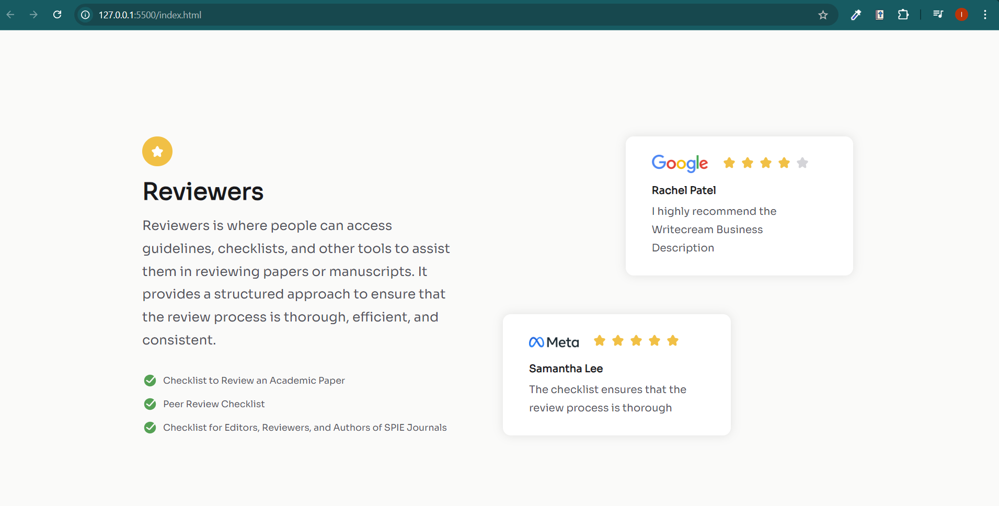

# **Testimonial Page**

## Tabla de Contenidos

1. [Descripción](#descripción-del-proyecto)
2. [Vista Previa](#vista-previa)
3. [Instalación](#instrucciones-de-instalación)
4. [Estructura de archivo](#estructura-de-archivos)
5. [Características principales](#características-principales)
6. [Mejora potencial](#mejora-potencial)


## Descripción del Proyecto

Este proyecto consiste en una **página de testimonios** que presenta una sección de revisión con herramientas y listas de verificación para revisores de artículos académicos, y una sección de testimonios de usuarios que han utilizado dichos recursos.

El proyecto está diseñado con **HTML5** y utiliza **CSS** para el diseño visual. Además, incluye la integración de **Google Fonts** para estilizar el texto. La estructura del sitio está organizada con un enfoque modular, dividiendo el contenido en secciones claramente definidas.


## Vista Previa



Puedes ver la versión demo en vivo aquí: [Testimonial Page](https://ibrahim-003.github.io/Testimonial-Page/)

## Instrucciones de Instalación

1. Clonar este repositorio en tu máquina local.
   ```bash
   git clone https://github.com/usuario/proyecto-testimonial.git
   ```
2. Asegúrate de que los archivos CSS (`reset.css` y `styles.css`) y las imágenes/SVG estén correctamente enlazados.
3. Abre el archivo `index.html` en tu navegador para ver la página.

## Estructura de Archivos

```
|-- index.html
|-- css
|   |-- reset.css
|   |-- styles.css
|-- assets
|   |-- google-testimonial.png
|   |-- meta-testimonial.png
|   |-- Star_fill.svg
|   |-- Done_ring_round_fill.svg
```

## Características Principales

- **Diseño Responsive:** Gracias a la configuración de `meta viewport`, la página se adapta a diferentes tamaños de pantalla.
- **Uso de Google Fonts:** Se utiliza la fuente `Sora` para un diseño moderno y legible.
- **Organización Clara:** Las secciones de la página están organizadas de manera modular, facilitando futuras actualizaciones o personalizaciones.
- **Interactividad Visual:** Íconos SVG y gráficos decorativos que mejoran la experiencia visual sin aumentar significativamente el tiempo de carga de la página.

## Mejora Potencial

- **Pie de página:** Agregar información útil como derechos de autor, redes sociales, o un formulario de contacto.
- **Interactividad con JavaScript:** Incorporar animaciones o efectos de hover para mejorar la interacción del usuario.
